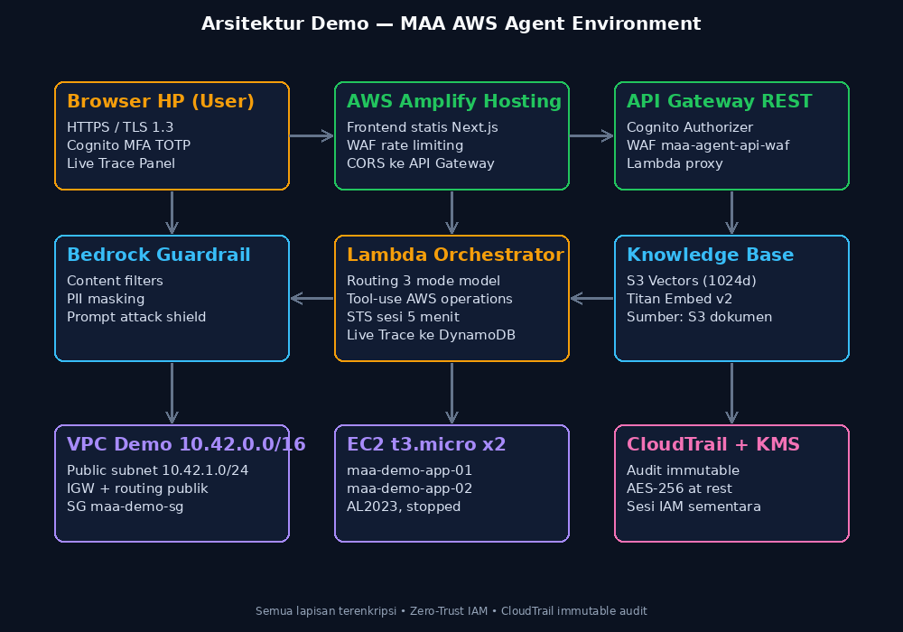

# MAA AWS Agent 🛡️

> **MAA (Map Active) AWS Agent** — Autonomous Enterprise Cloud Operations & Infrastructure Agent
> Dibangun 100% di atas AWS native: **Amazon Bedrock AgentCore** sebagai otak, tanpa server pihak ketiga.



## 📖 Daftar Isi

- [Ringkasan](#-ringkasan)
- [Akses Demo](#-akses-demo)
- [Yang Baru di v3.4](#-yang-baru-di-v34)
- [Fitur Utama (v3)](#-fitur-utama-v3)
- [Arsitektur](#-arsitektur)
- [Struktur Repositori](#-struktur-repositori)
- [Panduan Deploy](#-panduan-deploy)
- [Kontrak API](#-kontrak-api)
- [Keamanan](#-keamanan)
- [Biaya](#-biaya)


## 🚀 Yang Baru di v3.4

| Fitur | Detail |
|---|---|
| **Todo list live** | Tugas multi-langkah tampil sebagai checklist real-time di atas chat (tool `task_plan`), lengkap progress bar. |
| **Multi-agent / subagent** | Agent utama mendelegasikan ke agent spesialis (researcher/analyst/architect/coder/reviewer/ops) via `subagent_run`; aktivitas terlihat di Live Trace. |
| **Mode LONG** | Long-running task: hingga 24 iterasi tool, token 16k, eksekusi bertahap dengan todo list. |
| **Mode FULLSTACK** | Agent membangun SPA lengkap (HTML+CSS+JS inline) lalu deploy ke preview URL live (`deploy_web_app`). |
| **Mode PRESENTATION** | Deck slide interaktif bertema merah-hitam dibuat otomatis (`generate_presentation`) dan tampil di chat. |
| **Upload file** | Multi-file hingga **200 MB/file** via presigned S3 langsung dari browser (progress per file). CSV/JSON/teks/kode diekstrak ke konteks, gambar dilihat model, PDF diekstrak teksnya (pypdf). |
| **Translate EN→ID** | Tombol EN→ID pada setiap jawaban — terjemahan natural via nova-micro. |
| **Dokumentasi editable** | Markdown editor + preview live; hanya superadmin dapat menyimpan (tersimpan KMS-encrypted di S3). |
| **Manage Users advanced** | Kartu statistik, pencarian, wizard undangan 2 langkah (email Cognito / password instan), resend undangan, password instan per user. |
| **Login modern** | Split-screen branding, show password, remember me, dan penanganan challenge `NEW_PASSWORD_REQUIRED` (user undangan bisa set password baru + lanjut MFA). |
| **Fix Guardrail false-positive** | MISCONDUCT output strength → NONE: pertanyaan seperti “kamu bisa apa” tidak lagi diblokir. |
| **Fix “Loop berhenti”** | Final-synthesis fallback memaksa ringkasan jawaban setelah loop tool selesai / guardrail menahan output. |

Deploy satu perintah: `python3 aws/deploy_v34.py` (guardrail → runtime → edge/API GW → seed docs → Amplify).

## 🎯 Ringkasan

MAA AWS Agent adalah asisten operasional cloud yang mampu **menjawab, menganalisis,
dan mengeksekusi** operasi AWS secara otonom — mulai dari inspeksi resource, pembuatan
infrastruktur (IaC), hingga operasi destruktif dengan **konfirmasi dua tahap**. Aplikasi
web-nya berbahasa Indonesia, mobile-first, dan dirancang sesuai PRD dengan 14 area fitur
(F1–F14) yang seluruhnya terimplementasi.

Tiga mode kecerdasan dipisahkan sesuai karakter pertanyaan:

| Mode | Model | Kegunaan |
|---|---|---|
| **AUTO** (default) | dipilih otomatis | Router menilai kompleksitas pertanyaan lalu memilih FAST/DEEP + model terbaik |
| **FAST** | `amazon.nova-micro` (prompt caching) | Q&A operasional cepat & hemat |
| **DEEP** | `openai.gpt-oss-120b` (reasoning high) | Analisis arsitektur, troubleshooting kompleks |
| **MANUAL** | dropdown 88 model Bedrock | Bebas memilih model katalog (GLM-5, Kimi K2.5, DeepSeek V3.2, Llama 4, dll.) |

## 🔗 Akses Demo

| Item | Nilai |
|---|---|
| **URL Aplikasi** | https://main.d3m7p7m7eyo6tj.amplifyapp.com |
| **Region** | us-east-1 |
| **Kredensial demo** | `aws/maa-user-credentials.json` (tidak di-commit; minta ke admin) |

Login pertama di perangkat baru akan diminta **registrasi TOTP** (scan QR) — MFA wajib.
Kode TOTP 6 digit dari authenticator (Google Authenticator/Authy/1Password).

> ⚠️ File berisi kredensial (`awsenv.sh`, `maa-user-credentials.json`, `MAA-TOTP-QR.png`)
> sengaja dikecualikan dari git. Lihat [docs/SECURITY.md](docs/SECURITY.md).

## ✨ Fitur Utama (v3)

- **F01 — Autentikasi kuat**: Cognito User Pool + **TOTP MFA wajib**, manajemen sesi,
  idle logout 15 menit, rate-limit WAF di login & API.
- **F02 — Tiga mode + AUTO**: routing otomatis berbasis kompleksitas, dropdown 88 model
  dengan pencarian & pengelompokan, `autoDefaults` untuk hint model default.
- **F03 — Operasi AWS otonom**: EC2/EKS/RDS/S3/VPC/Route53 via 14+ tool; operasi
  destruktif memerlukan **modal konfirmasi 2x dengan mengetik challenge string** (TTL 5 menit).
- **F04 — Live Trace**: timeline eksekusi real-time (routing, pemanggilan tool,
  thinking, guardrail) dari CloudWatch Logs, polling tiap 1,5 detik.
- **F05 — Tema MAA Redline**: merah + garis hitam + latar putih, 8 preset aksen yang
  bisa diganti kapan saja (tersimpan di localStorage), dark mode.
- **F06 — URL sesi unik**: setiap sesi punya URL `/c/<sessionId>` (refresh tetap masuk
  sesi yang sama, seperti ChatGPT) berkat rewrite rule Amplify.
- **F07 — Logo MAA**: pin/monogram "M" merah khas (bukan z.ai), konsisten di header,
  login, favicon.
- **F08 — Memori lintas sesi**: AgentCore Memory mengubah riwayat percakapan menjadi
  konteks jangka panjang; `kb_search` mengambil dokumen Knowledge Base (S3 Vectors).
- **F09 — Edit pesan + versioning**: pesan user bisa diedit → agent meregenerasi jawaban;
  riwayat versi disimpan (`versions[]`), input/output bisa dicopy.
- **F10 — AgentCore native**: Runtime (otak), Memory (ingatan), Gateway (MCP tools),
  Code Interpreter, Policy Engine, Evaluations — menggantikan komponen self-built.
- **F11 — Menu Superadmin**: tambah user via email (undangan otomatis dari Cognito),
  enable/disable, hapus user; hanya grup `superadmin` yang bisa akses.
- **F12 — Menu Documentation**: dokumentasi lengkap di dalam aplikasi (docs-content).
- **F13 — Clarify**: saat instruksi ambigu, agent mengembalikan **daftar opsi untuk
  dikonfirmasi** (`clarify`) sebelum mengeksekusi.
- **F14 — Proactive questioning**: agent mempertanyakan parameter yang tidak jelas
  alih-alih menebak.

## 🏗️ Arsitektur

```
[Browser] ──TLS 1.3──► [AWS Amplify Hosting]  (frontend Next.js static export)
    │                        │
    │            [Cognito User Pool]  TOTP MFA wajib + WAF 100 req/5m
    ▼                        ▼
[API Gateway REST v1] ◄── [AWS WAF]  2000 req/5m + AWS Managed Rules
    │  Cognito Authorizer (ID token)
    ▼
[Lambda maa-agent-edge]  proxy tipis SigV4: async chat, status, trace,
    │                     sessions, models, KB presign, admin users
    ▼
[★ AgentCore Runtime]  otak agent (Python 3.12, ARM64/Graviton)
    ├── FAST  → nova-micro (prompt caching)
    ├── DEEP  → gpt-oss-120b (reasoning high)
    ├── MANUAL→ katalog 88 model Bedrock
    ├── Guardrail ff25xera9ylt   (content filter + PII + prompt attack)
    ├── Knowledge Base AZBQNYYPOY (S3 Vectors, multimodal parsing)
    ├── AgentCore Memory          (memori lintas sesi)
    ├── AgentCore Gateway (MCP)   (web tools)
    ├── AgentCore Code Interpreter (eksekusi kode analitik)
    ├── Policy Engine + Evaluations (governance)
    └── STS single-use → maa-agent-execution-role (zero-trust denies)
```

Prinsip desain kunci:

1. **Serverless end-to-end** — tidak ada server yang dioperasikan; biaya idle mendekati Rp0.
2. **Single-writer pattern** — hanya AgentCore Runtime yang menulis jawaban ke DynamoDB;
   edge lambda hanya fallback, mencegah duplikasi pesan.
3. **Least privilege** — execution role dibatasi resource eksplisit + `Deny` eksplisit
   untuk aksi berbahaya di luar whitelist.
4. **Kontrak ID token** — seluruh API memakai Cognito **ID token** (`Bearer`), konsisten
   dengan klaim `cognito:username` / `cognito:groups`.

## 📁 Struktur Repositori

```
├── aws/                          # Infrastruktur sebagai kode (boto3, idempoten)
│   ├── deploy_foundation.py      #   KMS, S3, DynamoDB, IAM roles
│   ├── deploy_bedrock.py         #   Guardrail, Knowledge Base (S3 Vectors), dokumen
│   ├── deploy_cognito.py         #   User pool + TOTP MFA + client
│   ├── deploy_runtime_role.py    #   IAM role untuk AgentCore Runtime
│   ├── deploy_v3_agentcore.py    #   Runtime v3 + Memory + Gateway + Policy + Eval
│   ├── deploy_runtime_v3.py      #   Packaging kode agent + deploy runtime
│   ├── deploy_edge_apigw_waf.py  #   Lambda edge + API Gateway + WAF
│   ├── deploy_amplify.py         #   Build static export + deploy Amplify
│   ├── fix_apigw_me.py           #   Patch /me + normalisasi OPTIONS (AWS_PROXY)
│   ├── seed_demo.py              #   Data demo: VPC + 2 EC2 (stopped)
│   ├── test_e2e.py / test_e2e_v3.py  # Uji end-to-end
│   ├── agent_runtime/main.py     #   OTAK AGENT (routing, 14 tools, guardrail, trace)
│   ├── lambda_edge/handler.py    #   Proxy tipis (semua endpoint)
│   └── state.json                #   Registry resource yang dideploy
├── src/                          # Frontend Next.js 15 (App Router, TypeScript)
│   ├── app/                      #   page.tsx (auth+splash), layout, globals.css
│   ├── components/maa/           #   chat-app, composer, model-picker, trace-panel,
│   │                             #   confirm-modal, drawers, sidebar, theme, docs…
│   └── lib/maa.ts                #   Klien API + tipe kontrak v3
├── docs/                         # Dokumentasi teknis (bahasa Indonesia)
├── scripts/                      # Utilitas (probe model, TOTP, diagnosa)
└── worklog.md                    # Log kerja multi-agent (internal, dikecualikan dari git)
```

## 🚀 Panduan Deploy

Prasyarat: akun AWS, Python 3.12 + boto3, Node/bun untuk build frontend.
Kredensial CLI disimpan di `scripts/awsenv.sh` (dikecualikan dari git — buat sendiri).

```bash
source scripts/awsenv.sh && cd aws

python3 deploy_foundation.py       # 1. KMS, S3, DynamoDB, IAM
python3 deploy_bedrock.py          # 2. Guardrail + Knowledge Base + dokumen KB
python3 deploy_cognito.py          # 3. User pool, TOTP wajib, app client
python3 deploy_runtime_role.py     # 4. IAM role runtime
python3 deploy_v3_agentcore.py     # 5. Memory, Gateway, Policy, Code Interpreter, Eval
python3 deploy_runtime_v3.py       # 6. Packaging agent + deploy Runtime + smoke test
python3 deploy_edge_apigw_waf.py   # 7. Lambda edge, API GW, WAF (routes + CORS)
python3 seed_demo.py               # 8. Resource demo
python3 test_e2e_v3.py             # 9. Uji end-to-end
python3 deploy_amplify.py          # 10. Build frontend + deploy Amplify
```

Semua script **idempoten** (aman diulang) dan mencatat hasilnya ke `aws/state.json`.
Detail tiap tahap: [docs/DEPLOYMENT.md](docs/DEPLOYMENT.md).

## 🔌 Kontrak API

REST `https://bklw93lic3.execute-api.us-east-1.amazonaws.com/v1` — Authorization: `Bearer <ID token>`.

| Endpoint | Method | Fungsi |
|---|---|---|
| `/me` | GET | Identitas + role (`superadmin` dari grup Cognito) |
| `/chat` | POST | Kirim pesan (`202` async) — dukung `editFrom` utk edit pesan |
| `/chat/status` | GET | Polling status, pesan (`versions[]`), `autoRoute`, `clarify`, konfirmasi pending |
| `/chat/trace` | GET | Live Trace (`?sessionId&after=ts`) dari CloudWatch |
| `/chat/sessions` | GET | Daftar sesi (riwayat URL `/c/<id>`) |
| `/chat/confirm` | POST | Konfirmasi destruktif tahap 1 & 2 (`typed1`, `typed2`) |
| `/models` | GET | Katalog 88 model + `autoDefaults` |
| `/kb/docs*` | GET/POST/DELETE | Dokumen Knowledge Base (presigned upload, sync, hapus) |
| `/admin/users*` | GET/POST/DELETE | Kelola user (khusus `superadmin`) + undangan email |
| `/admin/signout` | POST | Global sign out |

Lengkap dengan contoh payload: [docs/API.md](docs/API.md).

## 🔒 Keamanan

- **TOTP MFA wajib** di level pool; enrollment dipaksa pada login pertama.
- **WAF**: rate limit + AWS Managed Rules (SQLi/XSS di-*override* `Count` agar
  pertanyaan keamanan tentang exploit tidak diblok — eksekusi tetap di guardrail).
- **Guardrail Bedrock**: filter konten, PII (email/phone/SSN/AWS key), prompt attack.
- **KMS**: semua bucket & objek dienkripsi SSE-KMS; TLS-only bucket policy.
- **Zero-trust**: STS sesi ≤15 menit single-use untuk aksi resource; role execution
  memakai deny eksplisit; `Deny` IAM untuk aksi di luar whitelist.
- **Konfirmasi 2 tahap** untuk operasi destruktif (challenge string, TTL 5 menit).
- **Secret hygiene**: `.gitignore` mencegah kredensial masuk git; riwayat repo dibersihkan
  sebelum push. Detail: [docs/SECURITY.md](docs/SECURITY.md).

## 💰 Biaya

Serverless penuh — biaya idle ≈ **Rp0**. Komponen berbiaya kontinu:
WAF (~$6/bln) + penyimpanan micro (S3/DynamoDB/LCW). EC2 demo `stopped` (Rp0).
Estimasi detail: [docs/DEPLOYMENT.md → Optimasi Biaya](docs/DEPLOYMENT.md).
