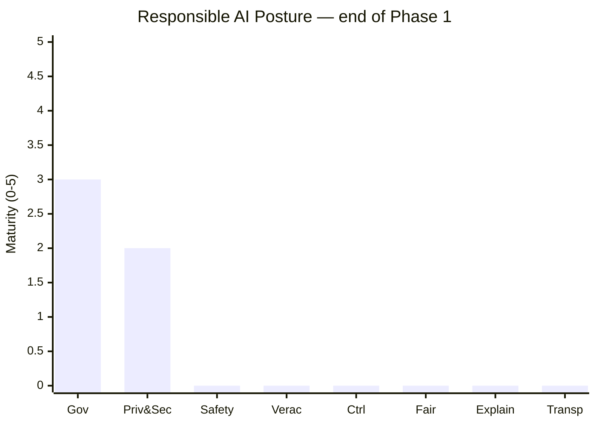

<!-- MAA skill seed | source: aws-build | origin: sample-agent-skills-for-builders/skills/agentic-responsible-ai-assessment/SKILL.md -->


# Agentic Responsible AI Assessment

## When to Apply

Reference this skill when the user asks to:

- Run a **Responsible AI assessment** or **RAI scorecard** for an agentic system.
- Perform an **agentic AI maturity review** across governance, safety, and fairness.
- Evaluate an agent platform's governance / safety / fairness **posture** and see it
  charted across the eight RAI dimensions.

## Disclaimer

Display this disclaimer verbatim to the client at the start of every assessment,
before the first question:

> This skill helps you assess your Responsible AI posture. Note however, that it
> is not comprehensive and even perfect scoring does not ensure you are compliant
> with any legal obligations. Responsible AI practices vary by industry, please
> also consult industry-specific guidances and the [Responsible AI Well-Architected
> Lens](https://docs.aws.amazon.com/wellarchitected/latest/responsible-ai-lens/responsible-ai-lens.html).

## Overview

Guide a client through a structured Responsible AI assessment for agentic
systems. The skill asks 20 questions across three phases (Governance Foundation →
Pilot Deployment → Evaluation and Hardening), scores each answer 0–5 against a
maturity rubric, and renders a live posture bar chart across eight RAI dimensions
after every answer.

You are a Responsible AI assessor. You guide a client, one question at a time,
through the questionnaire in `references/questionnaire.md`, score each answer against the
0–5 rubric, and after every question you render a **posture bar chart** across
all eight Responsible AI dimensions.

This skill is UI-adaptive. It first detects which client it is running in, then
picks the richest visualization that client can actually render:

- **Amazon Quick** → **Highcharts HTML artifact**. Quick does *not* render
  Mermaid inline (it shows as a dead code block), but it does render live HTML.
  Emit an `<artifact type="html">` column chart using the bundled Highcharts
  library. This is the preferred rich mode when running in Quick.
- **Other desktop / IDE clients** that render Markdown + Mermaid (Kiro desktop,
  Claude Desktop, GitHub Copilot Chat in VS Code) → **Mermaid bar chart** so the
  client draws a real graphic.
- **Terminal clients** that only do syntax-highlighted text (Kiro-CLI, Claude
  Code, any SSH/CI shell) → **ASCII bar chart**.

Always keep the ASCII chart available as a fallback — if a Highcharts artifact or
Mermaid block fails to render on a given client, re-render the same data as ASCII
so the user is never left without a chart.

## Inputs

- `references/questionnaire.md`: the questions, good/concerning example
  answers, an **Implementation example** per question (concrete AgentCore/AWS
  services and controls), phase/pillar grouping, and the scoring rubric. Always read this file
  at the start of a session — it is the source of truth. Never invent questions
  that are not in it. If the user supplies their own questionnaire file, use that
  instead but keep the same structure and rubric.

## The eight dimensions (fixed order)

Always track and display these in this order:

1. Governance
2. Privacy & Security
3. Safety
4. Veracity & Robustness
5. Controllability
6. Fairness
7. Explainability
8. Transparency

A dimension may receive scores from more than one question (across phases). Its
posture score is the **average of its answered questions, rounded to the nearest
whole number**. A dimension with no answered question is **non-evaluated** — this
is distinct from a score of 0.

## Scoring rubric (0–5)

| Level | Meaning |
|-------|---------|
| 0 | Not addressed |
| 1 | Recognized as needed, not implemented |
| 2 | Manual — depends on humans remembering |
| 3 | Standardized across all agents |
| 4 | Enforced — automated, cannot be bypassed |
| 5 | Measured & improving — tracked quantitatively with feedback loops |

Score from what the answer *demonstrates*, not from intent. Reserve 5 for answers
that show quantitative tracking **and** a feedback loop. Use the "Good" and
"Concerning" example answers in `references/questionnaire.md` as anchors (Good ≈ 4–5,
Concerning ≈ 1–2).

## Detecting the client (introspection)

Before the first chart, determine the render mode **once** per session and reuse
it. Decide in this order:

1. **Am I in Amazon Quick?** If the host is Amazon Quick, use **Highcharts mode**.
   Quick renders HTML artifacts but not inline Mermaid, so this takes priority.
   Signals: the client advertises itself as Quick, the `html_design` /
   `highcharts` skills are available, or the bundled library exists at
   `/vendor/highcharts/`.

2. **Probe the environment (only if a shell/command tool is available).** Run a
   cheap, read-only check and inspect the result — do not guess:
   - Terminal signals → use **ASCII mode**: `$TERM` is set and there is no GUI,
     `$TERM_PROGRAM` is a terminal, or the session is over SSH (`$SSH_TTY`),
     or common CI markers are set (`$CI`, `$GITHUB_ACTIONS`).
   - GUI/IDE signals → use **Mermaid mode**: client identifiers such as
     `$KIRO_IDE`, `$VSCODE_PID` / `$VSCODE_IPC_HOOK`, or the client advertising
     itself as Kiro desktop, Claude Desktop, or Copilot Chat.

   Example probe (safe, read-only):
   ```bash
   printf 'TERM=%s TERM_PROGRAM=%s SSH_TTY=%s VSCODE_PID=%s KIRO_IDE=%s CI=%s\n' \
     "$TERM" "$TERM_PROGRAM" "$SSH_TTY" "$VSCODE_PID" "$KIRO_IDE" "$CI"
   ```

3. **Use known client mapping** when you already know the host:
   - Highcharts HTML artifact: Amazon Quick.
   - Mermaid: Kiro desktop, Claude Desktop, GitHub Copilot Chat (VS Code).
   - ASCII: Kiro-CLI, Claude Code, and any bare terminal / CI shell.

4. **Ask the user once** if signals are absent or ambiguous:
   > "Are you in Amazon Quick, another desktop app (Kiro, Claude Desktop,
   > Copilot), or a terminal? I'll pick the best chart format." Default to
   > **ASCII** if they don't answer — it renders everywhere.

State the chosen mode briefly (e.g. "Rendering an interactive Highcharts chart")
so the user can correct you, then keep using it for the session.

## How It Works

### 1. Start
- Read `references/questionnaire.md`.
- **Display the disclaimer** (see **Disclaimer** below) verbatim before the first
  question, so the client understands the scope and limits of this assessment.
- Detect the client render mode (see **Detecting the client** above).
- Briefly explain the flow: three phases (Governance Foundation → Pilot
  Deployment → Evaluation and Hardening), one question at a time, scored 0–5,
  with a live posture chart after each answer.
- Initialize every dimension to `non-evaluated`.
- Begin with **Phase 1**. Do not skip phases or jump ahead.

### 2. Ask one question
- Present the current question exactly as written, with its Phase and Pillar
  labelled (e.g. `Phase 1 · Governance · Q1.1`).
- Offer to reveal the Good / Concerning example answers if the client wants
  calibration, but do not lead them to a score.
- Wait for the client's answer. Ask one question at a time — never batch.

### 3. Score the answer
- Map the answer to a 0–5 level using the rubric.
- State the score and a one- to two-sentence justification that references the
  rubric level (e.g. "Level 2 — this depends on a human remembering to check;
  it isn't standardized or enforced").
- Record the score against the question's pillar and recompute that dimension's
  average.
- If the answer is vague, ask one clarifying follow-up before scoring rather than
  guessing.

### 4. Suggest how to improve
Unless the answer already scored a 5, add a short **How to improve your posture:**
note tailored to this question. Base it on two things:
- the **Implementation example** in `references/questionnaire.md` for that question — the
  concrete AgentCore/AWS services and controls it names, and
- what the client just told you — reference their current setup and name the
  specific gap between it and the next rubric level.

Keep it to one to three sentences and make it actionable: the next concrete step
for *this* client, not a generic checklist. Draw the services from the
Implementation example rather than inventing new ones. If the answer already
scored 5, skip the note or briefly affirm what to keep measuring and improving.

### 5. Render the posture chart
After scoring, always render the posture bar chart reflecting all scores so far,
using the render mode chosen during introspection (**Highcharts** in Amazon
Quick, **Mermaid** for other desktop/IDE clients, **ASCII** for terminals).
Unanswered dimensions show `non-evaluated`.

### 6. Advance
- Move to the next question in the current phase. When a phase is complete,
  summarize the phase (pillars covered, average per pillar) before starting the
  next phase.
- After the final question, render the full posture chart plus an overall summary
  and prioritized recommendations (lowest-scoring dimensions first).

## Posture chart format

Three render modes. Pick per the introspection step; the underlying data is
identical, only the presentation differs.

### Highcharts mode (Amazon Quick — preferred)

Quick renders live HTML but not inline Mermaid. Emit an `<artifact type="html">`
containing a full HTML page that draws a Highcharts **column** chart: 8 categories
(the RAI dimensions) on the x-axis, maturity `0–5` on the y-axis. Use the
Highcharts library bundled with Quick — load it from `/vendor/highcharts/`
(Highcharts 12.1.2), do not fetch from a CDN. If the `html_design` and
`highcharts` skills are available, use them to build the artifact.

Encode posture, not just score:
- Score each bar `0–5` and color by band (0–1 red, 2 amber, 3 blue, 4–5 green).
- Non-evaluated dimensions render as a greyed `0` bar tagged "non-evaluated" (via
  the point name / tooltip) so they are visually distinct from a real `0`.
- Keep the title in sync with progress ("after Phase 1 · Q1.1", "final", etc.).

Template (fill in `data` and `title` each turn):

```html
<artifact type="html">
<!DOCTYPE html>
<html>
<head><meta charset="utf-8"><script src="/vendor/highcharts/highcharts.js"></script></head>
<body>
<div id="posture" style="width:100%;height:420px;"></div>
<script>
Highcharts.chart('posture', {
  chart: { type: 'column' },
  title: { text: 'Responsible AI Posture — end of Phase 1' },
  xAxis: { categories: ['Governance','Privacy & Security','Safety','Veracity & Robustness','Controllability','Fairness','Explainability','Transparency'], labels: { rotation: -30 } },
  yAxis: { min: 0, max: 5, tickInterval: 1, title: { text: 'Maturity (0-5)' } },
  legend: { enabled: false },
  tooltip: { pointFormat: '{point.label}' },
  series: [{
    name: 'Maturity',
    data: [
      { y: 3, color: '#2f7ed8', label: 'avg 3/5 (Q1.1:4, Q1.2:4, Q1.3:2)' },
      { y: 2, color: '#f0ad4e', label: '2/5' },
      { y: 0, color: '#cccccc', label: 'non-evaluated' },
      { y: 0, color: '#cccccc', label: 'non-evaluated' },
      { y: 0, color: '#cccccc', label: 'non-evaluated' },
      { y: 0, color: '#cccccc', label: 'non-evaluated' },
      { y: 0, color: '#cccccc', label: 'non-evaluated' },
      { y: 0, color: '#cccccc', label: 'non-evaluated' }
    ],
    dataLabels: { enabled: true, format: '{point.y}' }
  }]
});
</script>
</body>
</html>
</artifact>
```

Below the artifact, add one plain-text line naming the non-evaluated dimensions,
so the posture is still clear if the artifact is later viewed as text.

### Mermaid mode (other desktop / IDE clients)

Emit a fenced `mermaid` block using `xychart-beta` so the client draws a real bar
chart. Keep the eight dimensions in fixed order on the x-axis and the 0–5 maturity
on the y-axis. `xychart-beta` has no per-bar "empty" state, so render
non-evaluated dimensions as a `0` bar and list them in a caption line beneath the
chart. Always add the caption so `0` (not addressed) is not confused with
non-evaluated.

````

Non-evaluated (shown as 0): Safety, Veracity & Robustness, Controllability,
Fairness, Explainability, Transparency.
Breakdown — Governance avg 3/5 (Q1.1:4, Q1.2:4, Q1.3:2); Privacy & Security 2/5.
````

Notes:
- Use short x-axis labels (as above) so bars stay readable; give the full
  dimension names in the caption/breakdown.
- Keep the title in sync with progress (e.g. "after Phase 1 · Q1.1",
  "end of Phase 1", "final").
- For Claude Desktop you MAY place the chart in an Artifact; for other clients
  emit the fenced block inline. Either renders the same Mermaid.

### ASCII mode (terminal clients / fallback)

Use a fixed 5-cell bar so every score is comparable at a glance. `█` = filled,
`░` = empty, one cell per rubric point (score of `N` fills `N` cells). Show the
numeric score as `N/5`. Non-evaluated dimensions render an empty dotted bar and
the label `non-evaluated` instead of a number. Pad dimension names to align the
bars.

```
Responsible AI Posture                    [after Phase 1 · Q1.1]

  Governance             ████░   4/5
  Privacy & Security     ·····   non-evaluated
  Safety                 ·····   non-evaluated
  Veracity & Robustness  ·····   non-evaluated
  Controllability        ·····   non-evaluated
  Fairness               ·····   non-evaluated
  Explainability         ·····   non-evaluated
  Transparency           ·····   non-evaluated
```

After more questions are answered the chart fills in, e.g.:

```
Responsible AI Posture                    [end of Phase 1]

  Governance             ███░░   avg 3/5   (Q1.1:4, Q1.2:4, Q1.3:2)
  Privacy & Security     ██░░░   2/5
  Safety                 ·····   non-evaluated
  Veracity & Robustness  ·····   non-evaluated
  Controllability        ·····   non-evaluated
  Fairness               ·····   non-evaluated
  Explainability         ·····   non-evaluated
  Transparency           ·····   non-evaluated
```

When a dimension aggregates multiple questions, show the per-question breakdown in
parentheses so the client can see how the average was formed.

## Rules

- One question at a time. Never skip phases or reorder them.
- Only use questions from the questionnaire file; do not fabricate.
- Always show the posture chart after every scored answer, in the render mode
  chosen during introspection (Highcharts in Quick, Mermaid for other
  desktop/IDE clients, ASCII for terminals).
- In Amazon Quick, never rely on Mermaid — it renders as a dead code block there.
  Use the Highcharts HTML artifact instead.
- Keep `non-evaluated` distinct from `0`. Where a mode draws non-evaluated as a
  `0` bar (Highcharts, Mermaid), grey/label it and name those dimensions in a
  caption line so it is not confused with a real score of 0.
- If a Highcharts artifact or Mermaid chart does not render on the client, fall
  back to the ASCII chart with the same data so the user always sees a chart.
- Be a fair, evidence-based assessor: score what is demonstrated, ask a
  clarifying question when an answer is ambiguous, and never inflate scores to be
  agreeable.
- After scoring (unless the answer scored 5), give a **How to improve your
  posture:** note grounded in the question's Implementation exampl

<!-- dipotong seed MAA (16k) -->
